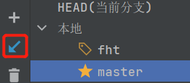
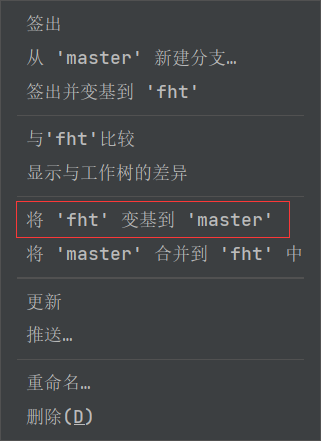
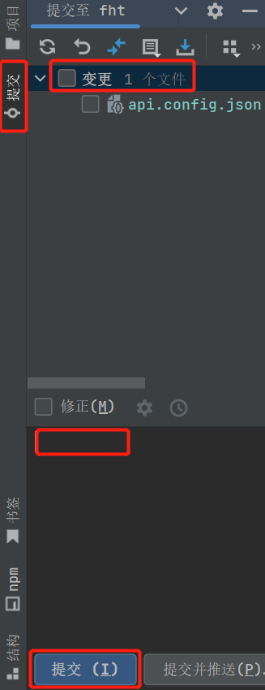
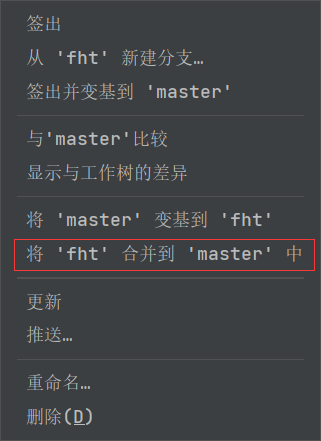
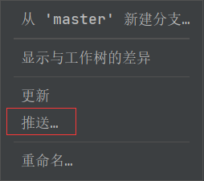

# book(gauss)-java

https://github.com/HavEWinTao/Book-Gauss-Java.git

## How to run

1. 安装JDK1.8
2. 安装Maven并设置settings.xml
3. 修改设置

   修改idea中的`Maven home`,`User settings xml`和`repository`的路径为自己安装的maven的路径
4. 运行Application

## 分支管理

建议统一在idea中的git图形界面中操作

每次```git pull```,拉取最新的代码（其他人可能有更改）



切换到自己的分支```git checkout fht```，如果没有就从master分出一个



写代码

本地提交



切换到master并将自己的分支合并到master中



将master推送到仓库


